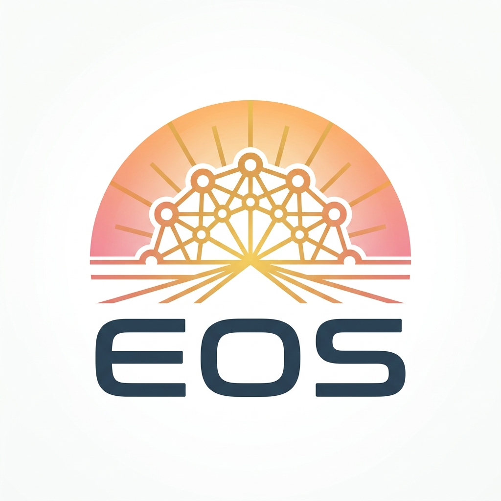

<div align="center">
  
</div>

# EOS - Environment Orchestration System

> Dans la mythologie grecque, Éos est la déesse de l'Aurore. Tout comme elle illumine le ciel et réveille le monde, le projet **EOS** réveille et démarre l'intégralité de votre environnement de développement distribué. Projet frère de *Aegis* (agrégateur de vulnérabilités).

**EOS** est un orchestrateur local conçu pour les développeurs travaillant avec de multiples dossiers, services ou micro-services. Il permet, en **1 seul clic**, de démarrer, gérer et monitorer tout votre environnement de développement.

## 🚀 Fonctionnalités Principales

- **Détection Automatique (Scanner)** : Ajoutez un projet via son chemin local, EOS analyse automatiquement son contenu (ex: `package.json`, `docker-compose.yml`) pour déterminer comment le lancer.
- **Un seul clic** : Lancez tous vos processus simultanément grâce au bouton "Aurore".
- **Monitoring** : Suivez l'état de santé de vos applications (En ligne, Erreur) et consultez leurs logs en temps réel.
- **Gestion individuelle** : Redémarrez ou arrêtez des processus spécifiques sans impacter le reste du système.

## 🛠 Stack Technique

- **Moteur / Backend** : [Bun](https://bun.sh/) (Serveur natif, gestion ultra-rapide des processus).
- **Frontend** : React 19, React Router v7.
- **Style & UI** : Tailwind CSS v4 + [Shadcn UI](https://ui.shadcn.com/).
- **Validation** : Zod.
- **Qualité de code** : Biome, Husky, Lint-staged.

## 📦 Installation & Lancement

1. Installez les dépendances :
   ```bash
   bun install
   ```
2. Lancez EOS en mode développement (Frontend + Backend) :
   ```bash
   bun run dev
   ```
3. L'interface est disponible sur `http://localhost:5173`.
